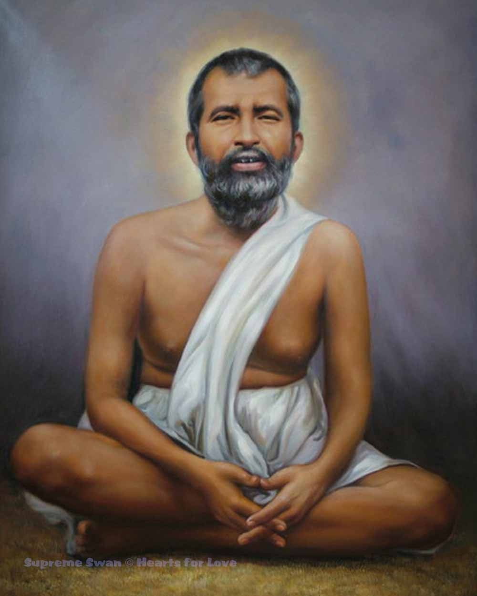
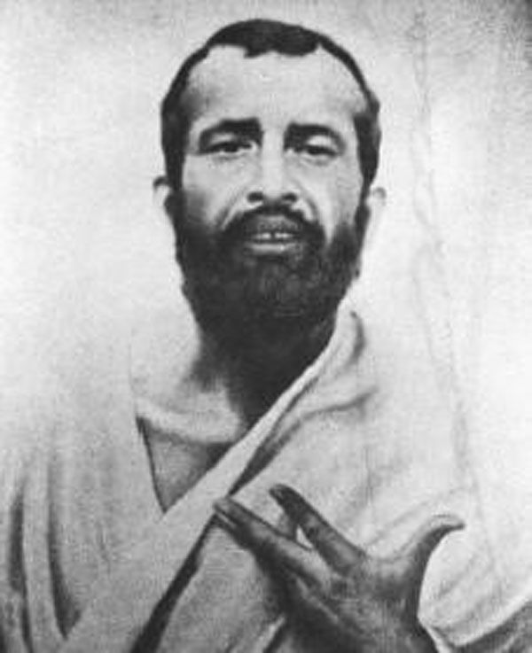
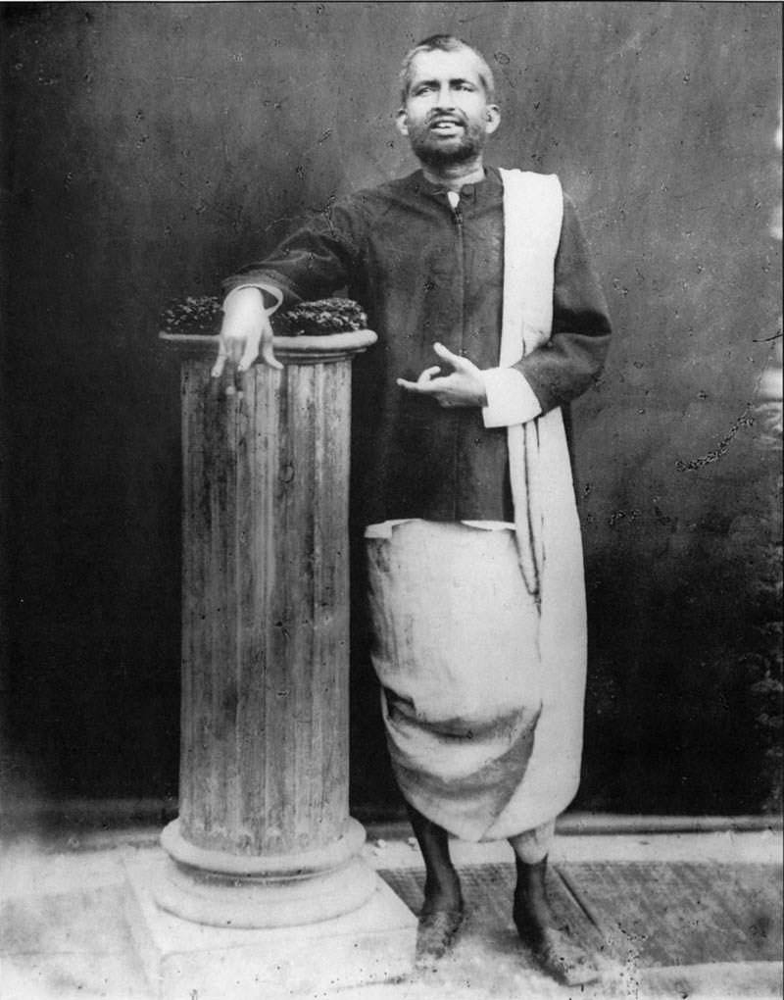
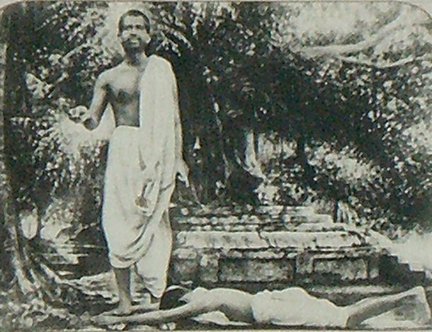
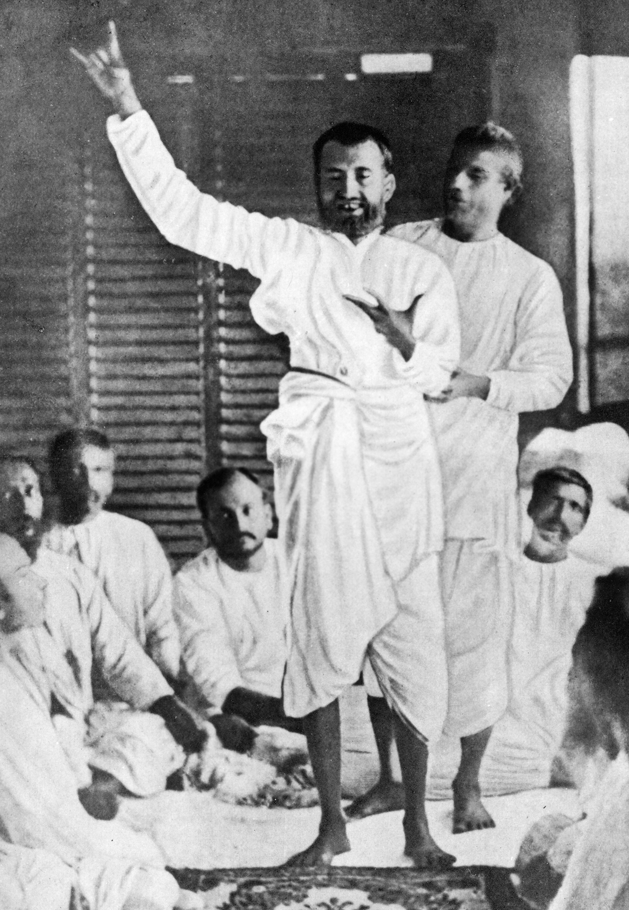
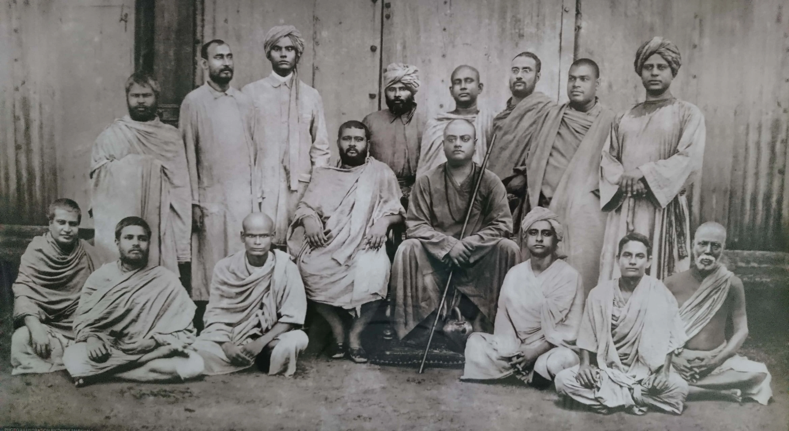
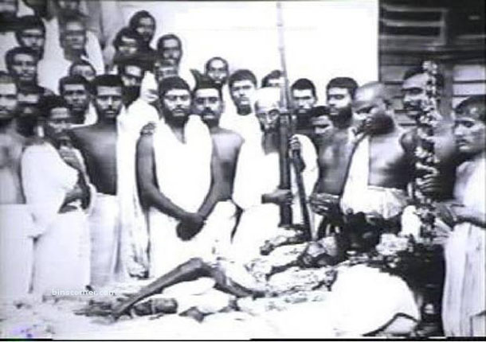

[Wikipedia](https://ru.wikipedia.org/wiki/%D0%A0%D0%B0%D0%BC%D0%B0%D0%BA%D1%80%D0%B8%D1%88%D0%BD%D0%B0)

[Притчи и рассказы Рамакришны](/books/Ramakrishna_Pritchi_i_istorii_Ramakrishnyi_522c0f_551944.epub)

## Биография

С исторической точки зрения, в Индии большее внимание уделяется учению святых и недостаточное внимание обращено на даты и детали. И всё же в случае со Шри Рамакришной мы имеем подлинные описания его жизни и того времени, в котором он жил. Это стало возможно благодаря тому, что многие из его учеников имели хорошее образование и сильное желание представить только факты, которые могли бы быть проверены по многочисленным источникам. Основная заслуга сбора и записи таких фактов принадлежит Свами Сарадананде, ученику Шри Рамакришны. Он написал авторитетную биографию под названием Шри Рамакришна Лилапрасанга, отсеивая факты от легенд и рассказов, которые росли вокруг Шри Рамакришны, с целью объяснить смысл его поучений и появления в этом мире. Существует два варианта перевода его книги на английский язык: первый под названием Swami Jagadananda Sri Ramakrishna The Great Master и новый, который называется Swami Chetanananda Sri Ramakrishna and His Divine Play

Тем не менее, самой известной записью вероучения Шри Рамакришны является Шри Рамакришна Катхамрита, написанная на бенгали Махендранатхом Гуптой (Шри М.), в английском переводе Swami Nikhilananda The Gospel of Sri Ramakrishna, частично переведённая на русский как Провозвестие Шри Рамакришны.

### Детство

18 февраля 1836 г. в деревне Камарпукур у бедной брахманской четы Кхудирама и Чандрамани родился младший сын Гададхар Чаттерджи, которого впоследствии назовут Рамакришной (согласно последним исследованиям имя Рамакришна было дано ему в соответствии с семейной традицией). Его родители были бедными и с трудом сводили концы с концами. В деревне он был всеобщим любимцем. С годами любовь жителей деревни к Рамакришне росла. Он был артистически одарённым мальчиком — умел петь, танцевать, участвовал в спектаклях, вырезал фигурки богов; его остроумные шутки приносили радость людям. Но он не очень охотно занимался в школе, говорил, что школьное обучение не даёт ему того знания, к которому он стремится, а учит только зарабатывать деньги. Общению со сверстниками он предпочитал беседы со странниками, которые, совершая паломничество в священный город Пури, по пути часто останавливались в его деревне. Он увлечённо и внимательно слушал их разговоры на духовные темы, прислуживал им.

Когда пришло время церемонии надевания священного шнура (Упанаяна, обряд совершаемый над мальчиками из касты брахманов), между Рамакришной и его взрослыми родственниками произошёл конфликт. Он настаивал на необходимости исполнения обещания, данного им одной из женщин деревни — принять во время церемонии пищу из её рук, несмотря на то, что она была шудрой. Это было нарушением традиций. Но Рамакришна был твёрд в своём решении. Он сказал: «Каким я буду брахманом, если не выполняю своего обещания?» И в конце концов взрослым пришлось уступить воле мальчика.

Тем временем, после смерти отца семейное финансовое положение ухудшалось с каждым днём. Рамкумар, старший брат Рамакришны, руководил небольшой санскритской школой в северной части Калькутты. Рамкумар привез Рамакришну в Калькутту, надеясь, что сможет обучить его санскриту. Он также предполагал, что Рамакришна сможет заработать немного денег для семьи, помогая ему выполнять его обязанности жреца.

### Принятие обязанностей жреца и начало духовной практики

В это время Рани Расмани, богатая женщина, но не брахманка, основала большой храмовый комплекс в Дакшинешваре, в северном пригороде Калькутты. Она подыскивала подходящего жреца для храма Кали, но брахманы отказывались служить в нём. Кто-то посоветовал Расмани предложить это место Рамкумару. И он, подчиняясь обстоятельствам, принял это предложение. Через несколько дней вслед за братом в Дакшинешвар приехал Гададхар (Рамакришна). Через несколько лет из-за слабого здоровья Рамкумар вынужден был оставить службу в храме и Гададхару пришлось принять обязанности жреца. Когда Гададхар начал поклоняться Кали, он стал спрашивать себя поклоняется ли он куску камня или живой богине. Если бы он поклонялся живой Богине, то почему она не реагирует на его поклонение? Он молился ей всем сердцем, а она не отвечала ему. Это не давало ему покоя. Или он совсем не достоин того, чтобы Мать Кали дала ему знак, что она довольна им? Но ведь были же такие верующие, как Рампрасад, которого она щедро одарила своей благодатью. Почему эта благодать не проливается на него? Почему она так жестокосердна к нему? И каждый вечер он восклицал: «О, Мать, прошёл ещё один день, и ты не явилась ко мне. Почему ты так жестока?» Иногда, с закусанными до крови губами, в отчаянии он катался по земле. Люди думали, что Рамакришна оплакивает смерть своей матери. Настал день, когда его нетерпение стало настолько мучительно, что он решился на самоубийство. Он сорвал со стены меч и готов был нанести себе смертельный удар. То, что произошло потом, Рамакришна описывает так: «Я увидел океан Духа, бесконечный, сияющий. Куда бы я ни глянул, везде вздымались громадные светящиеся волны… Они разбивались надо мной, они поглощали меня. Я задыхался. Я потерял сознание и упал. Вокруг меня катил свои волны океан невыразимой радости. И в самых глубинах своего существа я почувствовал присутствие Божественной матери».

### Женитьба

Вскоре Рамакришна стал переживать все более длительные периоды экстатического состояния, во время которых он полностью переставал осознавать окружающую его реальность. Он уже не мог сам заботиться о себе и, конечно, не мог исполнять обязанности жреца. Одни считали, что он совершенно сошёл с ума, другие думали, что он страдает истерическими припадками. Слухи о болезни Рамакришны дошли до его деревни. Естественно, его мать была очень встревожена и настаивала на том, чтобы Рамакришна вернулся домой. Он подчинился. Понаблюдав за поведением сына, Чандрамани пришла к выводу, что Рамакришна здоров. Но все же соседи посоветовали ей женить сына — женитьба могла оказать благотворное влияние на него. Мать забеспокоилась, что сын отвергнет её предложение. Выслушав мать, он не возразил ей, а отнесся к предложению с интересом. Он даже указал, где ему предстоит найти невесту.

> 
> Сарада Деви (1853—1920)

Этой девушкой стала Сарада, дочь Рамчандра Мукерджи, из соседней деревни Джайрамбати. Свадьба состоялась; Рамакришне в эту пору было 24 года, Сараде — 7 лет. Она была первой ученицей Шри Рамакришны. Он научил её всему тому, чему сам выучился от разных гуру. Считается, что она успешно прошла каждую религиозную практику так же быстро, как сам Шри Рамакришна. Впечатлённый её духовным потенциалом, он стал рассматривать её как саму Мать Вселенной и совершил Пуджу (поклонение) ей, рассматривая Сараду как настоящую Трипура Сундари Деви. Он сказал: «Я рассматриваю тебя как мою собственную мать и как Мать, которая находится в храме». Рамакришна убедил Сараду Деви в том, что она была не только матерью его молодых учеников, но также всего человечества. Поначалу Сарада Деви стеснялась этого предназначения, но постепенно стала выполнять его, вкладывая в это всю душу. Люди, преданные их учению, верят, что её отречение было поразительным качеством, которое она разделяла со своим мужем в равной мере, если не больше его. Полагают, что истинная природа их отношений и родства находится выше понимания обычных умов. Шри Рамакришна после постоянного близкого общения с ней пришёл к выводу, что её отношение к нему исключительно духовного плана. Их последователи убеждены, что, несмотря на то, что они жили вместе день и ночь, никаких других мыслей, кроме божественного присутствия, не возникло в их умах. Описание таких непрерывных божественных отношений между двумя душами противоположного рода является уникальным в истории религий, и не известно ни в одной из прошлых агиографий. После ухода из жизни Шри Рамакришны Сарада Деви сама стала религиозным учителем.

### Продолжение духовной практики

После приезда в Дакшинешвар Рамакришна вновь приступил к опытам духовного постижения. И когда бы он ни пожелал, Кали являлась ему, но он стал просить о большем. Он просил Кали указать ему другие пути постижения её. Позднее Рамакришна скажет: «У меня была возможность пройти разные пути постижения Бога». Как бы услышав молитву Рамакришны, один за другим в его жизни появляются учителя, чтобы повести его своей дорогой знания. Среди учителей была странствующая монахиня Бхайрави, последовательница тантрического учения. Она обладала не только глубокими йогическими и тантрическими знаниями, но и имела большой практический религиозный опыт. Шаг за шагом двигались они путём познания. И велико было изумление Бхайрави лёгкостью и быстротой, с которыми её ученик усваивал новые знания. Ещё одним учителем, оказавшим большое влияние на жизнь Рамакришны, был Тота Пури, странствующий аскет из монашеского ордена, обычно называемого нага (от нанга — нагой, обнажённый). Он был строгим адвайтистом, который не признавал окружающий мир реальностью. Для Тота Пури единственной реальностью был Брахман — Высшее Я. Тота Пури был поражён силой духа молодого человека. Он сказал, что познакомит его с философией недвойственности (Адвайтой) и посвятит в монашеский сан. И Рамакришна стал учиться недвойственности у Тота Пури. Обучение можно считать законченным тогда, когда ученик осознал свою истинную Природу как проявление Высшего Сущего. Это осознание происходит только во время трансцендентального опыта, известного как нирвикальпа самадхи. Этот опыт открывает природу единства всего сущего, он даёт понимание того, что все — и человек, и животные, и растения, вся вселенная — суть едины, и их природа — «бытие — сознание — блаженство». Рамакришна погрузился в состояние нирвикальпа самадхи и находился в нём три дня и три ночи. Тота Пури был поражён. Он сам достиг такого состояния только через сорок лет упорнейших усилий, а его ученик добился успеха с первой попытки. И, чудо из чудес — он находился в этом состоянии целых три дня и три ночи, не подавая никаких признаков жизни. Однако на этом не прекратились духовные искания Рамакришны. Он хотел испробовать все. И каким бы ни был путь, которым шли святые люди к Богу, — широким или узким, прямым или извилистым, — он все их хотел пройти, все хотел испытать. И каждый раз, когда Рамакришне нужен был учитель в этом поиске, он приходил. Таким образом, он пропустил через себя разные формы религиозного опыта от фетишизма до недвойственности. Как говорили его современники после ухода Тота Пури, Рамакришна оставался в течение шести месяцев в состоянии самадхи.

### Последующая жизнь

Постепенно имя Рамакришны стало известным в кругах калькуттской интеллигенции: подобно магниту, он стал привлекать истинных искателей Бога — одни приходили повидать его, других он навещал сам. Он учил основным положениям религий непрестанно в течение пятнадцати лет посредством притч, метафор, песен и больше всего примером собственной жизни. В 1885 году у него развился рак горла. Рамакришна умер 16 августа 1886 года в садовом доме в северном пригороде Калькутты, Коссипуре. Он оставил после себя группу из 16 преданных молодых учеников возглавленную известным религиозным деятелем и оратором, Свами Вивеканандой, а также множество последователей во всех концах света.
Религиозные аспекты
Поучения

Шри Рамакришна подчёркивал, что осознание Бога является высшей целью существования всех живых существ. Следовательно, для него религия служила средством для достижения этой цели. Мистическая реализация Шри Рамакришны, классифицированная традицией индуизма как нирвикалпа самадхи (буквально, «постоянная медитация», считающаяся погружением во всеохватывающее сознание), привела его к уверенности, что различные религии явятся различными путями достижения абсолютной реальности и что окончательная действительность никогда не может быть выражена в человеческих понятиях. Это согласовывается с заявлением «Ригведы», которое гласит что «Истина одна, но мудрецы называют её разными именами». Как результат этого мнения, Шри Рамакришна действительно провёл различные периоды жизни практикуя собственное понимание ислама, христианства и различных йогических и тантристских направлений в пределах индуизма.

> 
> Шри Рамакришна (Калькутта, 1881)

Последователи Шри Рамакришны верят, что реализация Шри Рамакришной нирвикалпа самадхи также привела его к пониманию двух сторон майи (иллюзии), о которых он упоминал как об авидьямайе (avidyamaya) и видьямайе (vidyamaya): Он объяснял, что авидьямайя представляет тёмные силы сознания (например: чувственные желания, низменные страсти, жадность, похоть и жестокость), которые держат мировую систему на более низких планах сознания. Эти силы ответственны за поимку человека в ловушку циклов рождения и смерти, с ними нужно сражаться и они должны быть побеждены. Видьямайя, с другой стороны, представляет более высокие силы создания (например: духовные добродетели, благородство, доброта, целомудрие, любовь и преданность), которые поднимает людей на более высокие планы сознания. С помощью видьямайи, говорил он, преданные могут освободиться от авидьямайи и достигнуть окончательной цели, став маятита (mayatita), то есть свободными от майя.

Провозглашение Шри Рамакришной идеи «ятра джив татра Шив» (где есть живое существо, там есть Шива) происходит из его восприятия действительности с точки зрения адвайта-веданты. Это понимание привело его к тому, что он учил своих учеников: «Дживе дайя ной, Шив гьяне джив сева» (не жалость к живым существам, но служение живым существам как самому Шиве). Это отношение значительно отличается от «сентиментального пантеизма» Франциска Ассизского.

Несмотря на то, что Шри Рамакришна был неграмотным, он был способен понять сложные философские идеи. Согласно его видению, наша вселенная и множество других вселенных (брахманда) являются просто пузырьками, возникающими на поверхности высшего океана интеллекта (Брахмана).

## Ключевые понятия в учении Шри Рамакришны

- Осознание Бога является высшей целью человеческой жизни, поскольку только это может принести человеку высшую радость и мир
- Бог Един, Он как личен, так и безличен в одно и то же время и известен под разными именами в различных религиях
- Бога возможно осознать различными путями, которые можно узнать из мировых религий
- Все религии истинны настолько, насколько они ведут к осознанию Абсолютной Истины
- Чистота ума, целомудрие — главное условие для осознания Бога, но Божья милость может спасти даже безнадёжного грешника
- Вместе с верой в Бога необходимо позитивное отношение к жизни, вместо того, чтобы предаваться самоосуждению или унынию
- Бог живёт во всех людях как Самосущий (Supreme Self), поэтому ко всем людям нужно относиться с уважением

Одно из описаний его жизни и учения сделано его учеником, Махендранатхом Гуптой, просто известным как «M», в книге на бенгальском языке Шри Рамакришна Катхамрита. В книге ярко представлен диалоговый стиль Шри Рамакришны, щедрое применение им метафор и притч, характерное ему остроумие и частое использование им диалектизмов и идиом бенгальского языка.

Подобно Шанкарачарье, который сделал это более тысячи лет тому назад, Шри Рамакришна Парамахамса оживил индуизм, который в девятнадцатом столетии был полон чрезмерного ритуализма и предрассудков и помог ему лучше реагировать на вызов, исходивший от ислама, христианства и современной материалистической цивилизации. Тем не менее, в отличие от Шанкарачарьи, Шри Рамакришна выработал идеи о сознании, которое снисходит в феноменальный мир после испытания им состояния самадхи, которое он назвал «Виджняна». Кроме утверждения высочайшей верности Адвайта Веданты, он также провозгласил, что принимает как «Нитью» Nitya (Вечный Субстрат) так и «Лилу» Leela (букв. игра, указывающая на динамическую Феноменальную Действительность) как аспекты одного Брахмана (Brahman).

Идея о нисхождении сознания, возможно, указывает на влияние идей бхакти (Bhakti) и некоторых школ шактизма на убеждения Шри Рамакришны. Эта идея позже повлияет на взгляды Шри Ауробиндо о Божественной Жизни на земле.

> 
> Swamis: (seated on the ground L to R): Shivananda, Saradananda, Subodhananda, Abedhananda, Premananda, Advaitananada; (seated on chairs L to R): Brahmananda, Vivekananda; (standing L to R): Adbhutananda, Yogananda, Akhandananda, Trigunatitananda, Turiyananda, Vijnanananda, Ramakrishnananda, Niranjanananda

