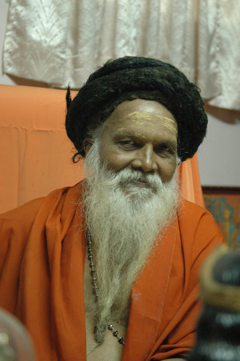
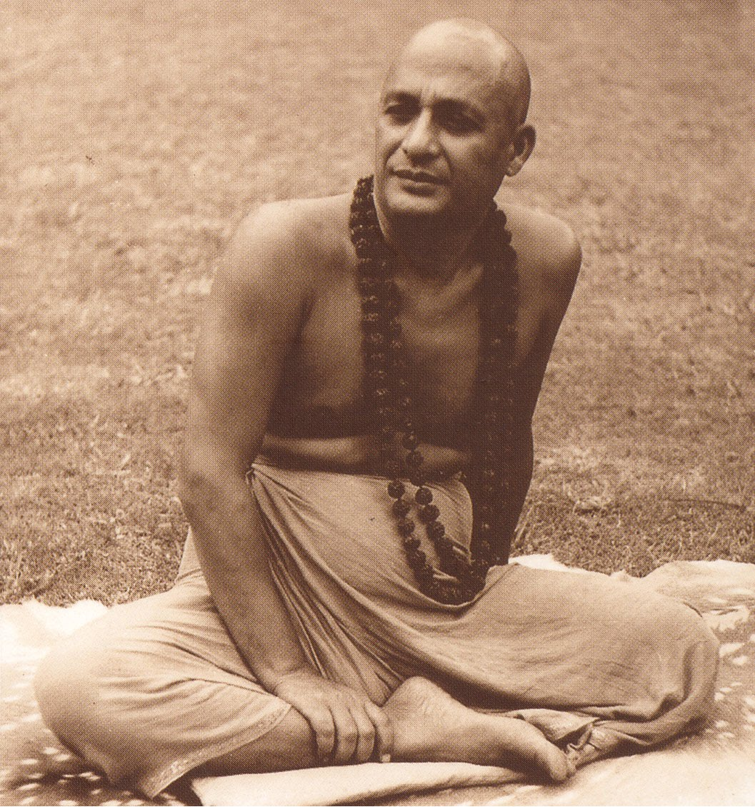
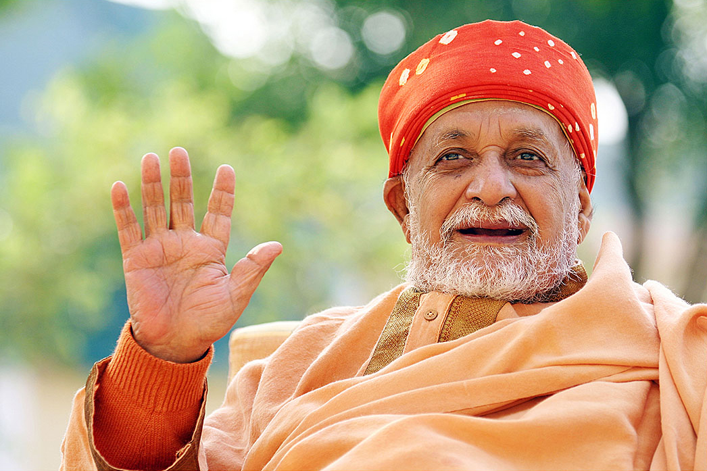
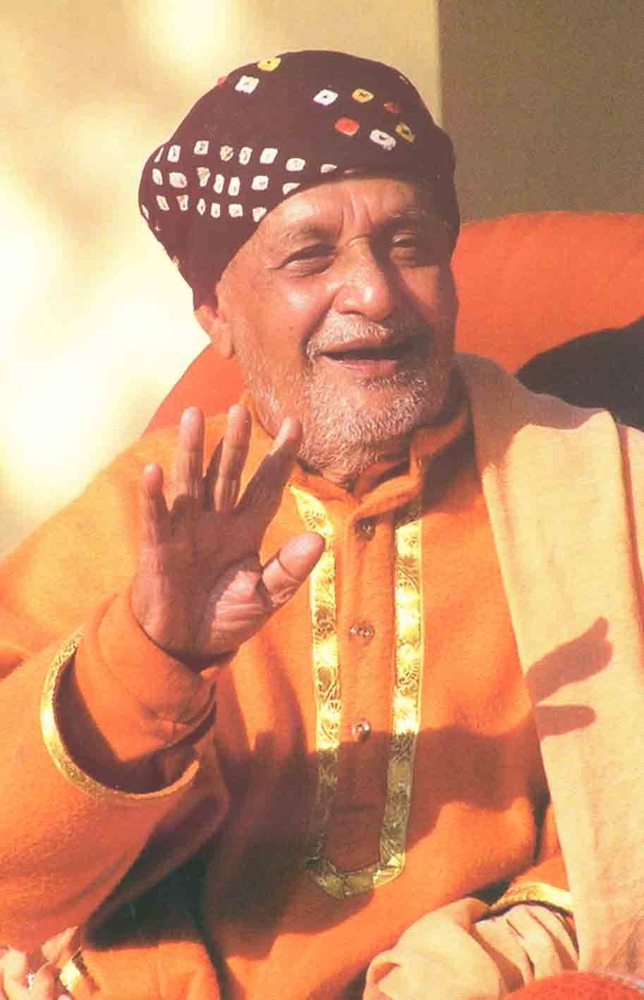
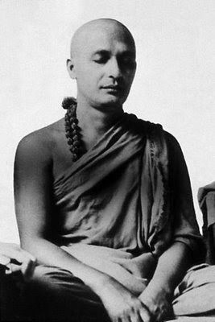

[Wikipedia](https://ru.wikipedia.org/wiki/%D0%A1%D0%B0%D1%82%D1%8C%D1%8F%D0%BD%D0%B0%D0%BD%D0%B4%D0%B0_%D0%A1%D0%B0%D1%80%D0%B0%D1%81%D0%B2%D0%B0%D1%82%D0%B8)

Свами Сатьяна́нда Сара́свати — йогин, мастер йоги и тантры, широко признанный как в Индии так и на Западе, один из учеников Свами Шивананды. Автор более 80 книг. Свами Сатьянанда основал несколько организаций, способствующих развитию и изучению йоги:

- Международное движение йоги в 1963 г.
- Бихарская школа йоги в 1964 г.
- Фонд исследований йоги в 1984 г.

## Биография

Свами Сатьянанда Сарасвати родился в 1923 году, в Индии, в маленьком городке близ Алморы, у подножья Гималаев. Описывается, что его благословляли многие святые и мудрецы, проходившие мимо его дома по пути к более высокогорным районам Гималаев. В детстве он был необычайно способный ребёнок и пережил свой первый духовный опыт в возрасте шести лет. После этого он стал искать причины подобных переживаний. Так он встретил своего первого духовного наставника — это была женщина тантрик, бхайрави Сукхман Гири, она дала ему базовые знания по тантре, шактипат, велела ему отправляться на поиски гуру. Так в 19 лет он покинул свой дом и больше никогда не возвращался туда.

Вскоре он прибыл в Ришикеш, где встретил Свами Шивананду, в котором он признал своего гуру. Следующие двенадцать лет он провёл в ашраме Свами Шивананды, где погрузился в карма-йогу до такой степени, что Свами Шивананда говорил, что он работает за четверых. Свами Сатьянанда трудился с рассвета до поздней ночи, занимаясь всем, от уборки до управления ашрамом. В 1947 году он принял посвящение в орден дашанами санньясы от своего учителя. После этого Свами Сатьянанда покинул Ришикеш и в течение восьми лет вёл жизнь странствующего аскета, путешествуя по разным уголкам Индии, Афганистана, Бирмы, Непала и Цейлона. В этот период он встречался со многими великими святыми и йогами, проводил время в уединении, формулируя и совершенствуя техники йоги.

В 1963 году ему открылась его миссия, и он основал Международное содружество йоги (Interantional Yoga Fellowship). Он поселился в Мунгере, где на берегу Ганги была основана Бихарская школа йоги, чтобы помогать людям на духовном пути. Вскоре ученики уже прибывали из всех уголков Индии и из-за рубежа. Учение Свами Сатьянанды распространялось по всему миру. Начиная с 1968 г. он активно ездил по всему миру, обучая древним практикам йоги людей всех национальностей, социальных групп, убеждений и религиозных верований. С тех пор Свами Сатьянанда приобрёл широкую известность на всех континентах как авторитетный представитель традиций йоги и тантры. Он направлял тысячи духовных искателей и вдохновлял многие ашрамы и духовные центры по всему миру. В течение последующих двадцати лет он делил своё время между поездками по Индии, зарубежным странам и пребыванием в ашраме в Мунгере.

В 1983 году Свами Сатьянанда передал все полномочия по управлению ашрамом своему преемнику Свами Ниранджананде Сарасвати.

В 1984 Свами Сатьянанда основал Шивананда-матх (Sivananda Math), благотворительную организацию для помощи слабо развитым и угнетённым слоям общества. В это же время он основал Фонд исследований йоги (Yoga Research Foundation), который сотрудничает с институтами, докторами и учёными, для проведения научных исследований в области йоги и тантры. В 1988 году Свами Сатьянанда покинул Мунгер и больше никогда не возвращался туда снова. Он принял образ жизни кшетра-санньяси и путешествовал инкогнито по святым местам Индии, не принимая помощи от тех организаций, которые он сам основал.

## Жизнь в Рикхии

В 1989 году в Трямбакишваре ему открылась его новая миссия и место её осуществления. 23 сентября 1989 года он прибыл в небольшую деревню Рикхия, рядом с городом Деогарх (штат Джаркханд), где основал Шри Панч Дашнам Парамахамса Алак Бара. Следующие 12 лет он провел в уединении, занимаясь сложными духовными практиками.

Начиная с 1994 года Свами Сатьянанда даёт своим ученикам и последователям новые наставления по бхакти-йоге (йога любви и преданности). Основным принципом данной йоги является любовь к Богу в форме служения человечеству. Шивананда-матх начинает оказывать активную поддержку жителям окружающих деревень в виде образования, медицинской помощи и базовых вещей для выживания, так как этот район считается одним из самых бедных в Индии. В 2001 году Свами Сатьянанада организует крупное жертвоприношение раджасуя, на которую он приглашает всех своих учеников. С этого момента он начинает регулярно проводить различные яджны и сатсанги, но он по-прежнему остаётся большую часть времени в уединении, редко появляясь на публике. Ашрам в Рикхии начинает постепенно разрастаться.

Свои последние годы Свами Сатьянанда провёл в Рикхии, занимаясь благоустройством и поддержкой жителей окружающих деревень, иногда давая наставления духовным искателям, которые приезжали к нему со всего света. Свами Сатьянанда умер в полночь, в ночь с пятого на шестое декабря 2009 года. Он назначил двух основных преемников своей традиции, это Свами Ниранджанананда Сарасвати и Свами Сатьясангананда Сарасвати (Свами Сатсанги), которые продолжают начатое им дело.

Свами Сатьянанда родился в Альморе (индийский штат Уттаранчал) в 1923 г.

Будучи с раннего возраста влекомым к духовной жизни, он оставил дом в восемнадцать лет и в 1943 году поступил на обучение к Свами Шивананде в Риши-кеше, который инициировал его в дашнами-санньясу в 1947. Он служил своему гуру в течение двенадцати лет, совершенствуя каждый аспект духовной жизни.

После этого он путешествовал по всему Индийскому субконтиненту в качестве странствующего аскета.
Осознавая потребность времени в виде научной интерпретации древней системы йоги, он основал Международное Содружество Йоги в 1956 г. В течение следующих двадцати лет Свами Сатьянанда поднял флаг йоги в каждой части света, превратил Бихарскую Школу в передовую школу йоги и написал более восьмидесяти важных книг по йоге, тантре и духовной жизни.

«Сатьянанда-Йога» стала традицией, сочетающей в себе классические знания с современным мировоззрением. В 1984 он основал Институт Исследования Йоги с целью объединения научных исследований и йоги и Шивананда-Матх для помощи нуждающимся. В 1988 г., находясь на вершине своих достижений, он отрёкся от всего, принял кшетра-санньясу и стал жить как аскет-парамахамса.

B 1989 он получил откровение о том, чтобы жить в Рикхии и выполнять там высшие ведические ритуалы, живя в уединении. Получив в 1991 г. распоряжение заботиться о соседях, он позволил ашраму помогать бедствующим селениям округи. Начиная с 1995 г. он выполнял двенадцатилетнюю Раджасуя-яджну с установкой на мир, достаток и процветание для всех, а в 2007 объявил об основании Рикхипитха с его девизом «служить, любить, отдавать».

Свами Сатьянанда достиг махасамадхи, йогического свершения в виде добровольного отбрасывания собственного тела с целью слияния со вселенским сознанием, в 2009 в присутствии своих учеников.

::: stanza

## Книги на русском языке

<list-books :books="$frontmatter.books" />

:::
